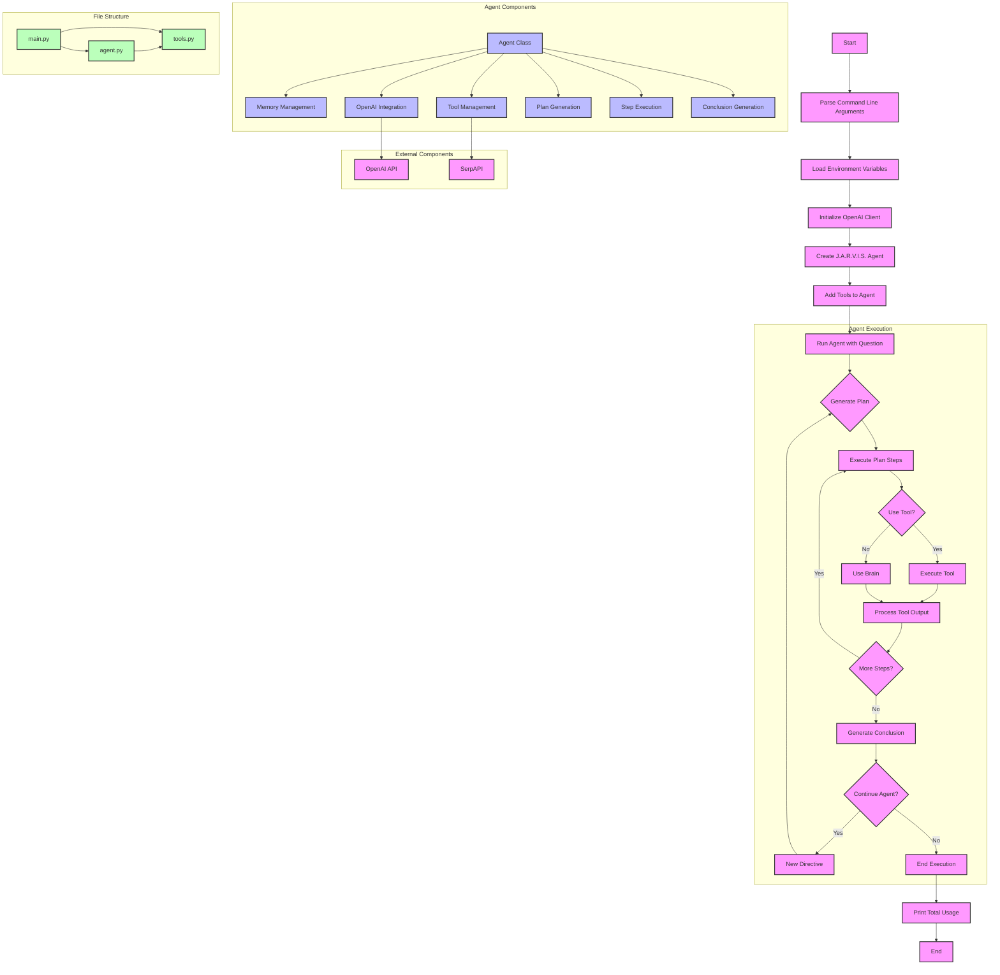

# SERP Agent

## Introduction

An agent designed to assist users with various tasks by leveraging OpenAI's language models and external tools. This project implements a flexible and extensible framework for creating AI agents capable of planning, executing, and reasoning about complex tasks.

## Project Structure

The project consists of three main Python files:

1. `agent.py`: Contains the core `Agent` class implementation.
2. `tools.py`: Defines external tools that the agent can use (currently includes internet search functionality).
3. `main.py`: The entry point of the application, setting up and running the agent.

## Usage

Run the agent with a specific question:

```
python main.py -q "Your question here"
```

## Components

### Agent

The `Agent` class (`agent.py`) is the core of the system. It handles:

- Memory management
- Tool management
- Planning and execution of tasks
- Interaction with OpenAI's language models

Key methods:
- `__init__`: Initializes the agent with a name and OpenAI client.
- `remember`: Adds a memory to the agent's memory list.
- `retrieve`: Finds the most similar memory to a given query.
- `add_tool`: Registers a new tool for the agent to use.
- `use_brain`: Generates responses using OpenAI's language models.
- `use_tool`: Executes a specific tool.
- `run`: Main method to execute the agent's workflow.

### Tools

The `tools.py` file contains external functionalities that the agent can use. Currently, it includes:

- `search_on_internet`: Performs a web search using the SerpAPI.

### Main Script

The `main.py` file is the entry point of the application. It:

1. Parses command-line arguments.
2. Sets up the OpenAI client.
3. Initializes the agent.
4. Adds the internet search tool to the agent.
5. Runs the agent with the provided question.

## Key Features

1. **Dynamic Planning**: The agent generates a plan of action based on the given directive.
2. **Tool Integration**: Easily extendable with new tools.
3. **Memory Management**: The agent maintains a memory of its actions and findings.
4. **Adaptive Execution**: The agent can adjust its plan based on intermediate results.
5. **Detailed Logging**: Provides colorful console output for easy tracking of the agent's thought process.
6. **Session Management**: Creates unique sessions for each run, saving all interactions and completions.

## Workflow

1. The agent receives a directive (question or task).
2. It generates a plan consisting of multiple steps.
3. For each step, the agent either:
   - Uses its "brain" (OpenAI's language model) to process information.
   - Utilizes an external tool (e.g., internet search).
4. After executing all steps, it generates a conclusion.
5. Based on the conclusion, it either continues with a new directive or completes the task.

## Flowchart



## Dependencies

- `openai`: For interacting with OpenAI's language models.
- `instructor`: Enhances interaction with OpenAI's chat models.
- `pydantic`: For data validation and settings management.
- `colorama`: For colored console output.
- `rich`: For pretty-printing JSON data.
- `requests`: For making HTTP requests (used in the search tool).
- `python-dotenv`: For loading environment variables.

## Environment Variables

The project requires the following environment variables:

- `OPENAI_API_KEY`: Your OpenAI API key.
- `SERPAPI_API_KEY`: Your SerpAPI key for internet searches.

These can be set in a `.env` file in the project root.

## Error Handling

The code includes basic error handling:

- Checks for missing API keys.
- Handles errors in API responses.
- Validates tool inputs using Pydantic models.

## Customization

To extend the agent's capabilities:

1. Add new tools in `tools.py`.
2. Register new tools in `main.py` using `agent.add_tool()`.

## Limitations

- The agent's knowledge is limited to the training data of the OpenAI model used.
- Internet search results may not always be up-to-date or accurate.
- The effectiveness of the agent heavily depends on the quality of the initial directive and the available tools.