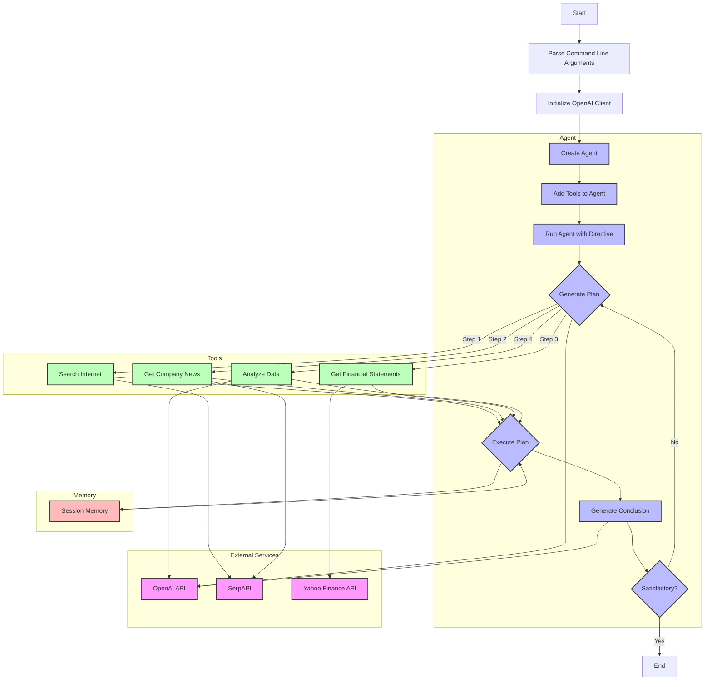

# Financial Analyst Agent


## Overview

This project implements a Financial Analyst Agent using OpenAI's language models and various financial data tools. The agent is designed to generate investment theses for specified companies based on the latest news and financial statements.

## Features

- Automated investment thesis generation
- Integration with OpenAI's language models
- Web scraping for latest company news
- Retrieval of financial statements and valuation measures
- Modular tool system for extensibility
- Session-based memory for contextual analysis

## Project Structure

The project consists of three main Python files:

1. `agent.py`: Defines the core `Agent` class
2. `tools.py`: Contains utility functions for data retrieval
3. `main.py`: Entry point of the application

## Usage

Run the script with a company name as an argument:

```
python main.py -c "Apple Inc"
```

This will generate an investment thesis for the specified company.

## Components

### Agent

The `Agent` class (defined in `agent.py`) is the core of the system. It has the following key features:

- Initialization with a name and OpenAI client
- Memory management for storing and retrieving information
- Tool management for adding and using various utility functions
- Planning and execution of multi-step processes
- Integration with OpenAI's language models for decision-making and text generation

Key methods:
- `remember()`: Stores information in the agent's memory
- `add_tool()`: Adds a utility function to the agent's toolkit
- `use_brain()`: Interfaces with the OpenAI model to generate responses
- `run()`: Executes the main workflow of the agent

### Tools

The `tools.py` file contains utility functions that the agent can use:

1. `search_on_internet()`: Performs a web search using the SerpAPI
2. `get_company_news()`: Retrieves recent news articles about a company
3. `get_company_name_and_ticker()`: Extracts company name and stock ticker (dummy implementation)
4. `get_financial_statements()`: Retrieves financial statements using the yahooquery library

### Main Script

The `main.py` file is the entry point of the application. It:

1. Parses command-line arguments
2. Sets up the OpenAI client
3. Initializes the Agent with necessary tools
4. Runs the agent with a directive to generate an investment thesis

## Workflow

1. The user provides a company name through the command line.
2. The agent generates a plan to analyze the company.
3. The plan is executed step by step, which may include:
   - Searching for company information
   - Retrieving recent news
   - Fetching financial statements
4. The agent uses its "brain" (OpenAI model) to process the information and generate insights.
5. Finally, the agent produces a conclusion, which is the investment thesis.

## Flowchart



## Dependencies

- openai
- instructor
- pydantic
- colorama
- rich
- python-dotenv
- requests
- yahooquery

## Environment Variables

The following environment variables need to be set:

- `OPENAI_API_KEY`: Your OpenAI API key
- `SERPAPI_API_KEY`: Your SerpAPI key for web searches

These can be set in a `.env` file in the project root.

## Limitations and Future Improvements

- The current implementation uses a dummy function for extracting company name and ticker. This could be improved with a more robust solution.
- Error handling and input validation could be enhanced for better reliability.
- The agent's memory is session-based and not persistent across runs. Implementing a database for long-term storage could be beneficial.
- More sophisticated financial analysis tools and metrics could be integrated to improve the quality of the investment theses.
- The project could benefit from unit tests to ensure reliability of individual components.