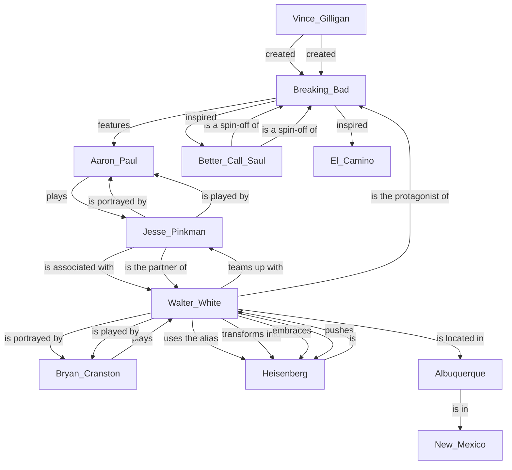

```mermaid
graph TD;
    Vince_Gilligan-->|created|Breaking_Bad
    Walter_White-->|is portrayed by|Bryan_Cranston
    Jesse_Pinkman-->|is portrayed by|Aaron_Paul
    Walter_White-->|uses the alias|Heisenberg
    Better_Call_Saul-->|is a spin-off of|Breaking_Bad
    Vince_Gilligan-->|created|Breaking_Bad
    Walter_White-->|transforms into|Heisenberg
    Walter_White-->|is located in|Albuquerque
    Jesse_Pinkman-->|is associated with|Walter_White
    Albuquerque-->|is in|New_Mexico
    Walter_White-->|teams up with|Jesse_Pinkman
    Walter_White-->|embraces|Heisenberg
    Heisenberg-->|pushes|Walter_White
    Walter_White-->|is|Heisenberg
    Walter_White-->|is the protagonist of|Breaking_Bad
    Jesse_Pinkman-->|is the partner of|Walter_White
    Breaking_Bad-->|features|Aaron_Paul
    Better_Call_Saul-->|is a spin-off of|Breaking_Bad
    Bryan_Cranston-->|plays|Walter_White
    Aaron_Paul-->|plays|Jesse_Pinkman
    Walter_White-->|is played by|Bryan_Cranston
    Jesse_Pinkman-->|is played by|Aaron_Paul
    Breaking_Bad-->|inspired|Better_Call_Saul
    Breaking_Bad-->|inspired|El_Camino
```